<div align="center">



<a href="https://github.com/DenverCoder1/readme-typing-svg">

</a>

</div>

I am a Master's student in Systems Security & Big Data, building toward **Cloud Security, DevSecOps, and Security Engineering**. I focus on secure infrastructure, security-aware delivery pipelines, and systems that are observable by design.

## Focus

<table>
<tr>
<td width="50%" valign="top">

<h3>01 — Cloud Security</h3>
<p>IAM, segmentation, logging, and infrastructure controls.</p>

</td>
<td width="50%" valign="top">

<h3>02 — DevSecOps</h3>
<p>CI/CD security, containers, IaC, and security automation.</p>

</td>
</tr>
<tr>
<td width="50%" valign="top">

<h3>03 — Security Engineering</h3>
<p>Secure architecture, threat-informed controls, and observability.</p>

</td>
<td width="50%" valign="top">

<h3>04 — Infrastructure Security</h3>
<p>Linux hardening, networking, isolation, and system security.</p>

</td>
</tr>
</table>

## Core toolbox

<div align="center">
  
</div>

## Engineering mindset

```yaml
security:
  identity: verify first
  privilege: minimize
  delivery: embed controls
  systems: harden by design
  telemetry: observe, then decide
```

## Connect

<a href="https://www.linkedin.com/in/ahmed-elrhorba-746513339/"></a> <a href="mailto:Ahmedelrh04@gmail.com"></a> <a href="https://github.com/ElrhAhmed"></a>
